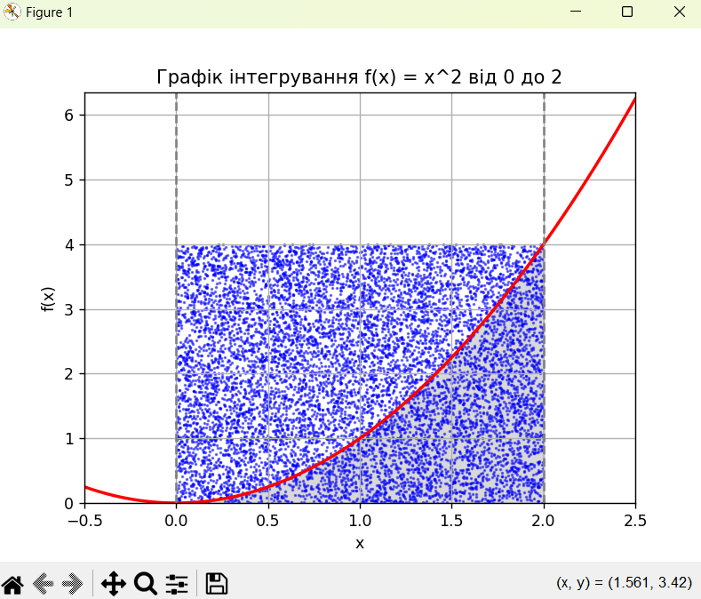

<h2>Завдання 1</h2>
<code>
print("Статус:", LpStatus[prob.status]) 
print("Кількість лимонаду:", lemonade.varValue) 
print("Кількість фруктового соку:", juice.varValue) 
print("Загальна кількість напоїв:", value(prob.objective))
</code>
<h4>Результати завдання 1</h4>
<code>
Статус: Optimal 
Кількість лимонаду: 30.0 
Кількість фруктового соку: 20.0 
Загальна кількість напоїв: 50.0
</code>
<h2>Завдання 2</h2>
Площа методом Монте-Карло: 2.6464  
<h4>Перевірка аналітичним розрахунком:</h4>

Первісна функція для f(x) = x^2 є F(x) = x^3 / 3.  
Тоді інтеграл від 0 до 2 буде F(2) - F(0) = 8 / 3 ≈ 2.6667.

<h2>Висновки</h2>
Метод Монте-Карло є наближеним методом, але він досить ефективний для обчислення інтегралів, особливо коли аналітичне рішення є складним або неможливим. Збільшуючи кількість випадкових точок, можна досягти більшої точності.